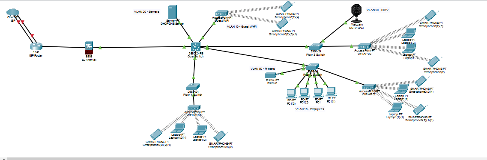

# 500 Employee Company Network

## Project Overview

This project is a company network designed and simulated using Cisco Packet Tracer. The network is divided into multiple VLANs to improve network organization, security, and management.

## Technologies Used

* Cisco Packet Tracer
* VLAN
* Core Switch
* Access Switch
* Firewall
* Router
* Wireless Access Points
* DHCP
* DNS
* CCTV Network

## Network VLANs

* VLAN 10 – Employees
* VLAN 20 – Servers
* VLAN 30 – CCTV
* VLAN 40 – Guest Wi-Fi

## Network Components

* Cisco Router
* Firewall
* Core Switch
* Floor/Access Switches
* Servers
* Wireless Access Points
* PCs and Laptops
* CCTV Cameras
* Smartphones
* Printers

## Project Features

* VLAN-based network segmentation
* Separate employee, server, CCTV and guest networks
* Wired and wireless connectivity
* Centralized network architecture
* Server and DHCP connectivity
* CCTV network implementation

## Project Files

* `500-Employee Company Network.pkt` – Cisco Packet Tracer project file
* `network-topology.png` – Network topology screenshot

## Network Topology

